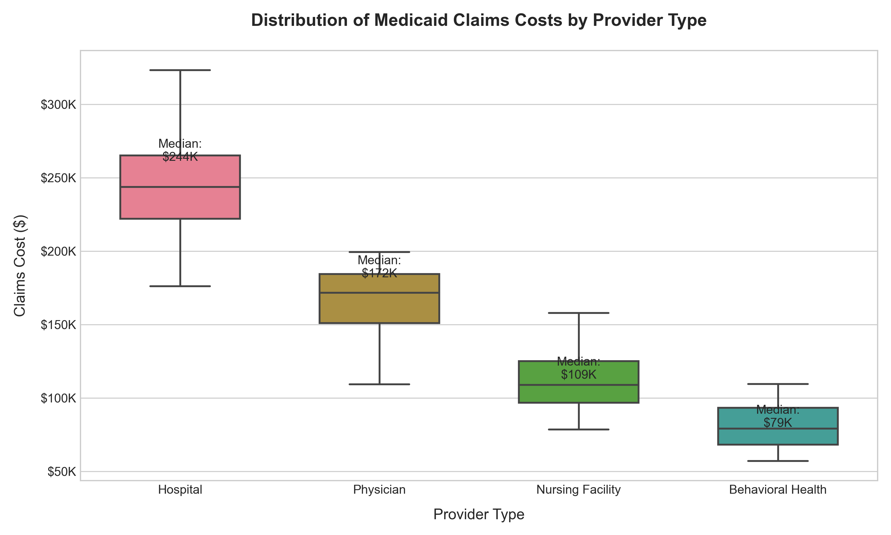

# Medicaid Claims Analysis Simulation


A simulated analysis of Medicaid claims data to identify cost trends, outliers, and reimbursement strategies using Python and SQL.

## 🛠️ Tech Stack
- **Python**: Pandas, NumPy, Matplotlib
- **SQL**: Query optimization, aggregation
- **Data Sources**: Synthetic claims data mimicking CMS/BLS

## 📊 Key Analyses
1. **Cost Trends**: Monthly spend visualization
2. **Outlier Detection**: Top 5% high-cost claims
3. **Reimbursement Modeling**: Provider-specific rate simulation

## 🚀 How to Run
```bash
git clone https://github.com/courtneyclo/medicaid-claims-analysis.git
pip install pandas numpy matplotlib jupyter
jupyter notebook medicaid_analysis.ipynb
```

Directly on Browser:
[](https://mybinder.org/v2/gh/courtneyclo/medicaid-claims-analysis/HEAD?labpath=notebook%2Fmedicaid_analysis.ipynb)
## 📈 Sample Output



## 🔗 Connect
[LinkedIn](https://linkedin.com/in/courtneylo) | Email: courtneylo08@yahoo.com
